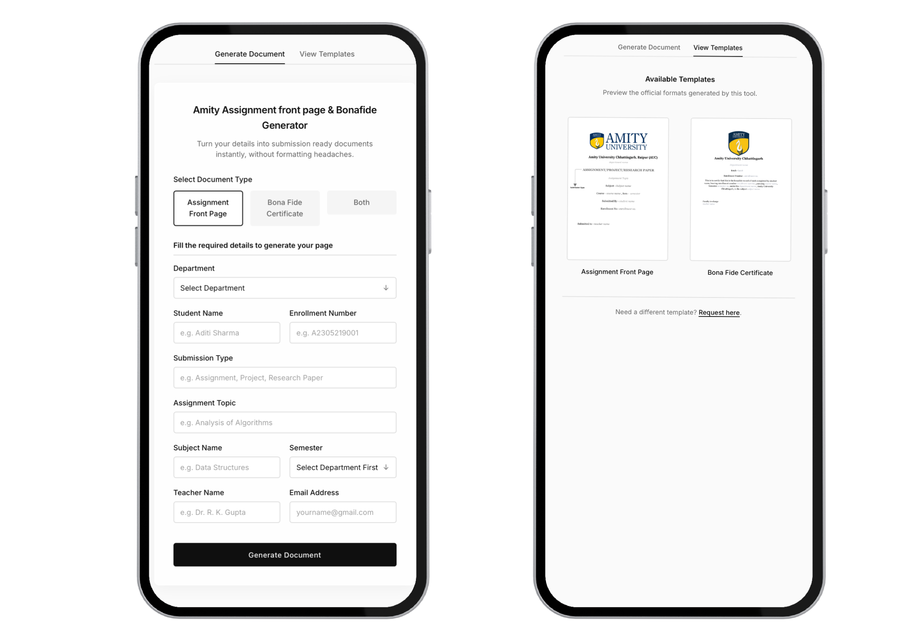
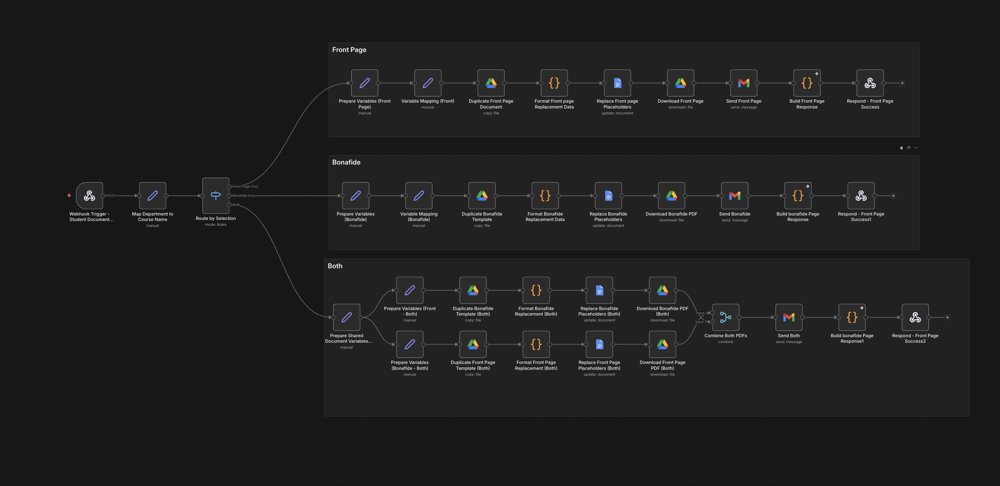

# Amity Assignment front page & Bonafide Generator

A professional, responsive web application designed to generate official Amity University assignment front pages and bona fide certificates instantly. This project streamlines the submission process by generating formatted PDFs via a secure serverless webhook integration.




## 🚀 Features

- **Multiple Document Types**: 
  - **Assignment Front Pages**: Standardized format for assignments.
  - **Bona Fide Certificates**: Official certificate generation for students.
  - **Both Generation**: Generate both documents simultaneously.
- **Dynamic Form Logic**:
  - Context-aware fields that show/hide based on the selected document type.
  - Intelligent Semester handling: Auto-calculates validation and Roman numeral conversion (e.g., 3 -> III).
- **Smart User Experience**:
  - **Local Storage**: Remembers student details (Name, Enrollment, Dept) for faster future use.
  - **Input Formatting**: Auto-capitalizes names for a professional look.
  - **Validation**: Ensures all required fields (handling email formats, enrollment patterns) are correct before submission.
- **Modern UI/UX**:
  - Minimal design aesthetic.
  - Fully responsive layout for Desktop, Tablet, and Mobile.
  - Real-time status feedback (Loading, Success, Error toasts).

## ⚙️ How it Works: The n8n Workflow

This project is powered by an n8n automation workflow that orchestrates the entire document generation process.



### The Automation Flow
1.  **Form Submission**: The frontend sends a JSON payload to the Secure Webhook (via Netlify Proxy).
2.  **Course Mapping**: The workflow receives all the required informattion including the Department name and maps it to the specific Course Code (e.g., "Amity School of Engineering" -> "B.Tech").
3.  **Roman Numeral Conversion**: The semester input (e.g., "3") is automatically converted to Roman numerals ("III") to match official formats.
4.  **Template Strategy**:
    *   The workflow identifies whether the user requested a **Front Page**, **Bona Fide**, or **Both**.
    *   It locates the corresponding **Google Doc Template** stored in Drive.
5.  **Dynamic Generation**:
    *   **Duplication**: A temporary copy of the template is created to ensure the master remains untouched.
    *   **Placeholder Replacement**: The workflow scans the document for placeholders (e.g., `__StudentName__`, `__EnrollmentNo__`) and injects the submitted data.
6.  **Delivery**:
    *   The document is exported as a PDF.
    *   An email is sent to the student with the PDF attached.

## 📥 Quick Start: Import Workflow

I have provided the complete n8n workflow file to get you started immediately.

1.  **Locate the File**: The workflow JSON is located at [`assets/workflow/n8n_amity_workflow.json`](assets/workflow/n8n_amity_workflow.json).
2.  **Import to n8n**:
    - Open your n8n dashboard.
    - Click **"Add workflow"** > **"Import from..."** > **"File"**.
    - Select `n8n_amity_workflow.json`.
3.  **Configure Credentials**:
    - You will need to authenticate your **Google Drive**, **Google Docs**, and **Gmail** nodes within n8n after importing.

## 🏗️ Setup & Development

### Prerequisites
- Node.js & npm (for Netlify CLI).
- A [Netlify](https://www.netlify.com/) account.
- An **n8n** instance (Self-hosted or Cloud) with a webhook workflow set up to receive the JSON payload.


### Deploy to Netlify

1.  Push your code to a Git provider (GitHub, GitLab, Bitbucket).
2.  Import the project into Netlify.
3.  **Configuration**:
    - **Build Command**: (Leave empty for static site)
    - **Publish Directory**: `.` (Current directory)
4.  **Environment Variables** (Critical):
    - Go to **Site Settings > Environment Variables**.
    - Add `WEBHOOK_URL` with your actual n8n webhook URL.
5.  Deploy!

## 🎨 Customization Guide

### 1. Modifying the Templates
The system uses Google Docs as the template engine, making it easy to design without coding.
1.  **Create your design** in Google Docs.
2.  **Add Placeholders**: Use the format `__FieldName__` (double underscores) where you want dynamic data to appear (e.g., `__SubjectName__`, `__TeacherName__`).
3.  **Update n8n**: In your n8n workflow "Google Docs" node, map the incoming JSON keys to these placeholders.

### 2. Adding New Fields
1.  **Frontend**: Add the new `<input>` field in `index.html` and update `script.js` to include it in the JSON payload.
2.  **Backend (n8n)**: 
    - Open your "Webhook" node to see the new data structure.
    - Update your "Google Docs" node to map this new field to a new placeholder in your template.

## 🛠️ Tech Stack

- **Frontend**: HTML5, CSS 3 (Custom Variables, Flexbox/Grid), Vanilla JavaScript (ES6+).
- **Backend Proxy**: Netlify Functions (Node.js).
- **PDF Engine**: n8n Automation Workflow (Webhook listener -> PDF Generation -> Email/Download).

## 📂 Project Structure

```
├── index.html            # Main application UI
├── css/
│   └── style.css         # Global styles
├── js/
│   └── script.js         # Core logic
├── assets/
│   ├── img/              # System images (favicon, etc.)
│   ├── templates/        # Template previews
│   └── workflow/         # n8n workflow JSON
├── netlify.toml          # Netlify configuration
├── netlify/
│   └── functions/        # Serverless functions
├── .gitignore            # Git exclusion rules
└── README.md             # Project documentation
```

## 🤝 Contributing

Contributions are welcome! If you have ideas for new features:

1.  Fork the repository.
2.  Create a feature branch (`git checkout -b feature/NewTemplate`).
3.  Commit your changes.
4.  Push to the branch.
5.  Open a Pull Request.

## 📄 License

This project is open source and available under the [MIT License](LICENSE).

---

*Disclaimer: This tool is an independent project and is not officially affiliated with Amity University backend systems, though it generates formats compliant with university standards.*
